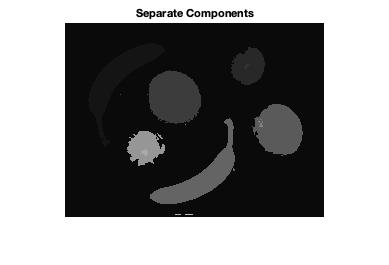
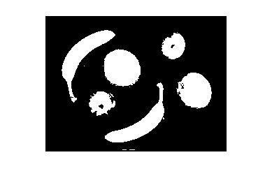
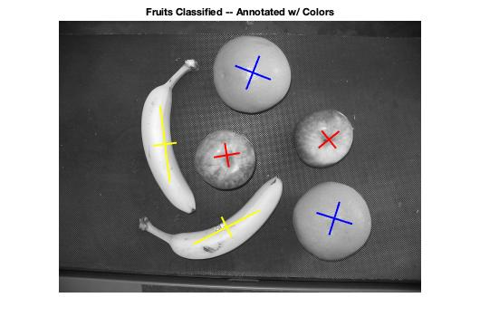

# Principal Component Analysis

### Introduction

Principal component analysis can be used to classify data that is seemingly grouped. Data can be processed so that each individual component can be identified as unique through various methodologies. The method used in this implementation utilizes double thresholding for background deletion. Each continuous object should then be identifiable as a unique entity. PCA can then be applied to classify each object. The center of mass for each object can be used to identify the center of the object.
After constructing a covariance matrix for an object, the major and minor axes an ellipse can be computed. The orientation of the ellipse can be determined by obtaining the eigenvalues. Each object can then be classified using the data available. In this implementation, the data is used to identify the types of fruits in an image.

In order to classify the fruits and provide axes on them, a series of steps were performed.  First, we classified the picture into moments which divides the picture into regions.  The image is labeled as f(x,y).  
The image is also classified as dark gray or not dark gray which allows Matlab to find the specific labeled regions.  


Figure 1: Original Image:


### Classification Methodology

The moments are in 2D with the labels m00, m01, m10, m11, m20, and m02.  These moments were then used to calculate the central moment of the picture’s regions.  If there was no centroid of a region, then the 
calculation would exit the central moment for loop calculation.  Now that the central moments of the regions have been calculated for the picture, the eigen-values can be calculated.  The eigen-values are what classify each fruit. Bananas, oranges, and apples all have different axis lengths.  The eigenvalues are used to calculate the semimajor and semiminor axis lengths. 


These axes lengths help calculate the eccentricity.  The eccentricity is used to classify the shape of the fruit.  If the eccentricity value is closer to 0 then the shape is closer to a circle.  If the eccentricity value is
closer to 1 then the shape is closer to a line.  To find the eccentricity, the equation uses the distance from the center of an ellipse.  For the banana in the picture, if the eccentricity value calculated in the program was calculated between 0.94 and 0.98, then the axis was paired with the banana.  If the eccentricity value was less than 0.6 but more than 0, then it was classified as “round fruit,” which is the apples and the oranges.  Then we had to differentiate between the apples and oranges since both of the fruits are round.  If the radius of the fruit is larger than the mean, then that fruit was classified as an orange. Below displays the final image with the respected axes to each fruit.   

* Bananas

Bananas are identified by computing the eccentricity of the matched ellipse. If the eccentricity of the object is be- tween .94 and .98 with an appropriate length, then it is assumed that the respective fruit is a banana.

* Apples & Oranges

Oranges are classified according to size. Since it is highly probable that the fruits will be of different sizes under dif- ferent circumstances, the sizing of the fruits needs to be dynamic. This is achieved by computing the sizes of the fruits using the distance formula.

The sizes of the fruits are then stored in a array associa- ted with another array of the following format: [[major_x, major_y, minor_x, minor_y]]. Every object with a radius below one standard deviation of the mean is culled. Objects that are larger than average are deemed to be oranges. The rest of the fruits are classified as apples.

### Result 
Figure 2: 



Figure 3: 



Figure 4: 



### Implementation

```
function Ateam_BestEllipse(image,L,num_components,labels)
    
    roundFood_1 = [];
    roundFood_2 = [];
    figure;
    imshow(image);
    title('Fruits Classified -- Annotated w/ Colors');
    
    [height,width] = size(image);

    %image=double(image);


for c=1:num_components

    m00=0;
    m01=0;
    m10=0;
    m11=0;
    m20=0;
    m02=0;
    
    for i=1:height
        for j=1:width
         
            if(L(i,j) == labels(c))
                m01 = m01 + i.^0 * j.^1;
                m00 = m00 + i.^0 * j.^0;
                m10 = m10 + i.^1 * j.^0;
                m11 = m11 + i.^1 * j.^1;
                m20 = m20 + i.^2 * j.^0;
                m02 = m02 + i.^0 * j.^2;
            end
        end
    end
            
        xc = m10/m00;
        yc = m01/m00;
        
        if(isnan(xc) || isnan(yc))
            break;
        end
    
        u00 = m00;
        u11 = m11 - yc*m10;
        u20 = m20 - xc*m10;
        u02 = m02 - yc*m01;
        
        C = [u20, u11; u11, u02];
        C = (1/u00).*C;
        
        E = eig(C);
        theta = .5*atan2(2*u11,u20-u02);
        ecc = sqrt((E(2)-E(1))/E(2));
        
        major_x = [xc - cos(theta)*sqrt(E(2)), xc, xc + cos(theta)*sqrt(E(2))];
        major_y = [yc - sin(theta)*sqrt(E(2)), yc, yc + sin(theta)*sqrt(E(2))]; 
        hold on;

        minor_x = [xc + cos(-1.5708+theta)*sqrt(E(1)), xc, xc + cos(1.5708+theta)*sqrt(E(1))];
        minor_y = [yc + sin(-1.5708+theta)*sqrt(E(1)), yc, yc + sin(1.5708+theta)*sqrt(E(1))];
        
        len = sqrt(power(major_x(3)-major_x(1),2)+power(major_y(3)-major_y(1),2));
        
        if(ecc >.94 && ecc < .98 && ~isnan(ecc) && len > (width)/5)
        line(major_y,major_x, 'Color', 'y', 'LineWidth', 2);
        line(minor_y,minor_x, 'Color', 'y', 'LineWidth', 2);
        end
    
        if(ecc >0 && ecc <.6 && ~isnan(ecc))
       
        roundFood_1 = cat(1, roundFood_1, [major_x, major_y, minor_x, minor_y]);
        end
end

t_radii = [];
f_sf = [];
n_sf = size(roundFood_1);
radii = [];

for f=1:n_sf(1)
    t_radii = [t_radii sqrt(power(roundFood_1(f,3)-roundFood_1(f,1),2)+power(roundFood_1(f,6)-roundFood_1(f,4),2))];
end

n_rad = size(t_radii);
r_mean = mean(t_radii);
r_std = std(t_radii);

for f=1:n_sf(1)
    if(t_radii(f) >= r_mean-r_std)
        radii = [radii t_radii(f)];

        roundFood_2 = cat(1, roundFood_2, roundFood_1(f,:));
    end
end
n_rad = size(radii);
n_sf = size(roundFood_2);
for f=1:n_sf(1)
    if(radii(f) >= mean(radii)-.01*std(radii))
        
        line([roundFood_2(f,4), roundFood_2(f,5), roundFood_2(f,6)],[roundFood_2(f,1), roundFood_2(f,2), roundFood_2(f,3)], 'Color', 'b' , 'LineWidth', 2);
        line([roundFood_2(f,10), roundFood_2(f,11), roundFood_2(f,12)],[roundFood_2(f,7), roundFood_2(f,8), roundFood_2(f,9)], 'Color', 'b', 'LineWidth', 2);
    else
        line([roundFood_2(f,4), roundFood_2(f,5), roundFood_2(f,6)],[roundFood_2(f,1), roundFood_2(f,2), roundFood_2(f,3)], 'Color', 'r', 'LineWidth', 2);
        line([roundFood_2(f,10), roundFood_2(f,11), roundFood_2(f,12)],[roundFood_2(f,7), roundFood_2(f,8), roundFood_2(f,9)], 'Color', 'r', 'LineWidth', 2);
    end
end


end
        
```
